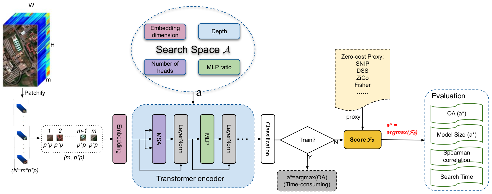

# HyTAS: A Hyperspectral Image Transformer Architecture Search Benchmark and Analysis (ECCV 2024)

## Installation
pip install -r requirements.txt

## Datasets
Because the datasets are quite large, we have only uploaded Indian Pines to the dataset folder, the others can be found via the citations in our paper or by request to zhoufangqin123@gmail.com.

## Experiments
### To run the search scripts, specify a search proxy in the search_xx.sh, then run with bash command, for example,
$bash search_indian_sf_final.sh

### To run the retrain scripts, specify a dataset and path in the train_xx.sh, then run with the bash command, 
$bash train_searched_sf.sh

## Results
Individual retrain and search results are saved under outputs/   
Merged results of each dataset are saved under results/  
For visualizing results, see analysis.ipynb

## Contact
If you have any questions, please contact zhoufangqin123@gmail.com

## Acknowledgement
The implementation is built upon [TF_TAS](https://github.com/decemberzhou/TF_TAS.git)  
Thanks for their great work!

